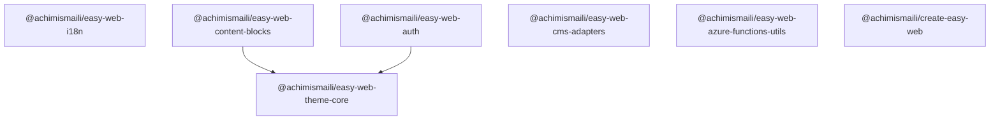
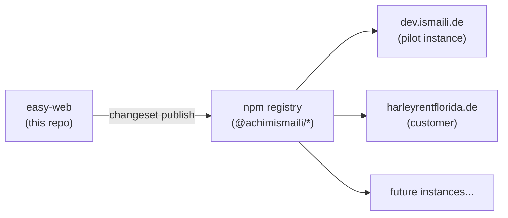

## Monorepo Structure

The easy-web repository is a **pnpm + Turborepo monorepo** publishing focused, independently-versioned npm packages:

```
easy-web/
├── packages/
│   ├── theme-core/                      # CSS design tokens, light/dark theme
│   ├── i18n/                            # i18n routing and SEO helpers
│   ├── easy-web-content-blocks/         # Astro UI components
│   ├── auth/                            # MSAL.js authentication wrapper
│   ├── easy-web-cms-adapters/           # Decap CMS integration
│   ├── easy-web-azure-functions-utils/  # Server-side helpers (planned)
│   └── create-easy-web/               # Scaffold CLI (planned)
└── apps/
    └── docs/                            # This documentation site
```

## Package Dependency Graph



`theme-core` is the only shared dependency. All other packages are independent of each other.

## The Consumer Pattern

Site instances install easy-web packages from the public npm registry:



**The key benefit**: changes to easy-web packages benefit **all site instances simultaneously** — just merge a Version PR and all consumers update on the next `pnpm install`.

## Release Workflow

Releases are automated with [Changesets](https://github.com/changesets/changesets):

1. Contributor runs `pnpm changeset` to describe the change
2. Changesets bot creates a **"Version Packages"** PR when changesets accumulate
3. Merging the PR **publishes all changed packages** to npm via GitHub Actions (OIDC, no stored tokens)

## Technology Stack

| Layer | Technology |
|-------|-----------|
| Package manager | pnpm workspaces |
| Build orchestration | Turborepo |
| Language | TypeScript |
| UI framework | Astro (components), React (auth island) |
| Authentication | MSAL.js (Microsoft Authentication Library) |
| CMS | Decap CMS (git-based) |
| Testing | Vitest |
| Documentation | Astro Starlight |
| CI/CD | GitHub Actions |
| Releases | Changesets |

## Single Auth Island (Important)

All auth-dependent React components on a page **must live inside a single React island**. React Context does not cross Astro island boundaries — two separate `client:*` islands would create two independent MSAL instances.

```astro
<!-- ✅ CORRECT: one island wraps all auth components -->
<AuthProvider client:only="react" config={msalConfig}>
  <UserProfile />
  <LoginButton />
</AuthProvider>

<!-- ❌ WRONG: two islands = two MSAL instances = broken auth -->
<UserProfile client:only="react" />
<LoginButton client:only="react" />
```
