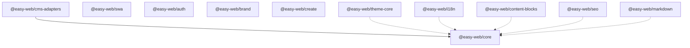
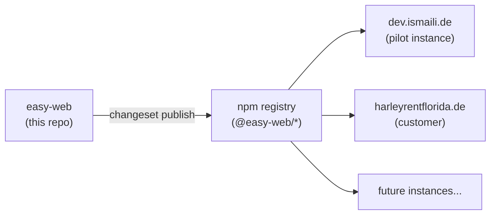

## Monorepo Structure

The easy-web repository is a **pnpm + Turborepo monorepo** publishing one base package, a few add-ons and five compatibility shims, all on one shared version:

```
easy-web/
├── packages/
│   ├── core/                            # Base: tokens, i18n, SEO, markdown, components, contracts
│   ├── easy-web-cms-adapters/           # Add-on: Decap CMS, typed content definitions
│   ├── easy-web-swa/                    # Add-on: Azure Static Web Apps 404 config
│   ├── auth/                            # Add-on: MSAL.js authentication wrapper
│   ├── easy-web-brand/                  # Add-on: favicon and icon generation
│   ├── create-easy-web/                 # Reserved: scaffold CLI (planned)
│   ├── theme-core/                      # Deprecated shim, re-exports core/theme
│   ├── i18n/                            # Deprecated shim, re-exports core/i18n
│   ├── easy-web-content-blocks/         # Deprecated shim, re-exports core/components
│   ├── seo/                             # Deprecated shim, re-exports core/seo
│   └── easy-web-markdown/               # Deprecated shim, re-exports core/markdown
└── apps/
    ├── docs/                            # This documentation site
    ├── showcase/                        # Live component gallery
    ├── contract-fixture/                # Conformance gate test site
    └── compat-fixture/                  # Proves the compatibility shims still build
```

## Package Dependency Graph


```mermaid
graph TD
    CORE["@easy-web/core"]
    CMS["@easy-web/cms-adapters"]
    SWA["@easy-web/swa"]
    AUTH["@easy-web/auth"]
    BRAND["@easy-web/brand"]
    CLI["@easy-web/create"]
    TC["@easy-web/theme-core"]
    I18N["@easy-web/i18n"]
    CB["@easy-web/content-blocks"]
    SEO["@easy-web/seo"]
    MD["@easy-web/markdown"]

    CMS --> CORE
    TC -.-> CORE
    I18N -.-> CORE
    CB -.-> CORE
    SEO -.-> CORE
    MD -.-> CORE
```

`core` is the base every site installs. `cms-adapters` depends on it for the content contracts; `swa`, `auth` and `brand` are independent. The dashed edges are the deprecated compatibility packages, which only re-export core and are removed in 2.0.

## The Consumer Pattern

Site instances install easy-web packages from the public npm registry:


```mermaid
flowchart LR
    EW["easy-web\n(this repo)"]
    NPM["npm registry\n(@easy-web/*)"]
    DEV["dev.ismaili.de\n(pilot instance)"]
    HARLEY["harleyrentflorida.de\n(customer)"]
    FUTURE["future instances..."]

    EW -->|"changeset publish"| NPM
    NPM --> DEV
    NPM --> HARLEY
    NPM --> FUTURE
```

**The key benefit**: changes to easy-web packages benefit **all site instances simultaneously** — just merge a Version PR and all consumers update on the next `pnpm install`.

## Release Workflow

Releases are automated with [Changesets](https://github.com/changesets/changesets):

1. Contributor runs `pnpm changeset` to describe the change
2. Changesets bot creates a **"Version Packages"** PR when changesets accumulate
3. Merging the PR **publishes all changed packages** to npm via GitHub Actions (OIDC, no stored tokens)

## Technology Stack

| Layer | Technology |
|-------|-----------|
| Package manager | pnpm workspaces |
| Build orchestration | Turborepo |
| Language | TypeScript |
| UI framework | Astro (components), React (auth island) |
| Authentication | MSAL.js (Microsoft Authentication Library) |
| CMS | Decap CMS (git-based) |
| Testing | Vitest |
| Documentation | Astro Starlight |
| CI/CD | GitHub Actions |
| Releases | Changesets |

## Single Auth Island (Important)

All auth-dependent React components on a page **must live inside a single React island**. React Context does not cross Astro island boundaries — two separate `client:*` islands would create two independent MSAL instances.

```astro
<!-- ✅ CORRECT: one island wraps all auth components -->
<AuthProvider client:only="react" config={msalConfig}>
  <UserProfile />
  <LoginButton />
</AuthProvider>

<!-- ❌ WRONG: two islands = two MSAL instances = broken auth -->
<UserProfile client:only="react" />
<LoginButton client:only="react" />
```
