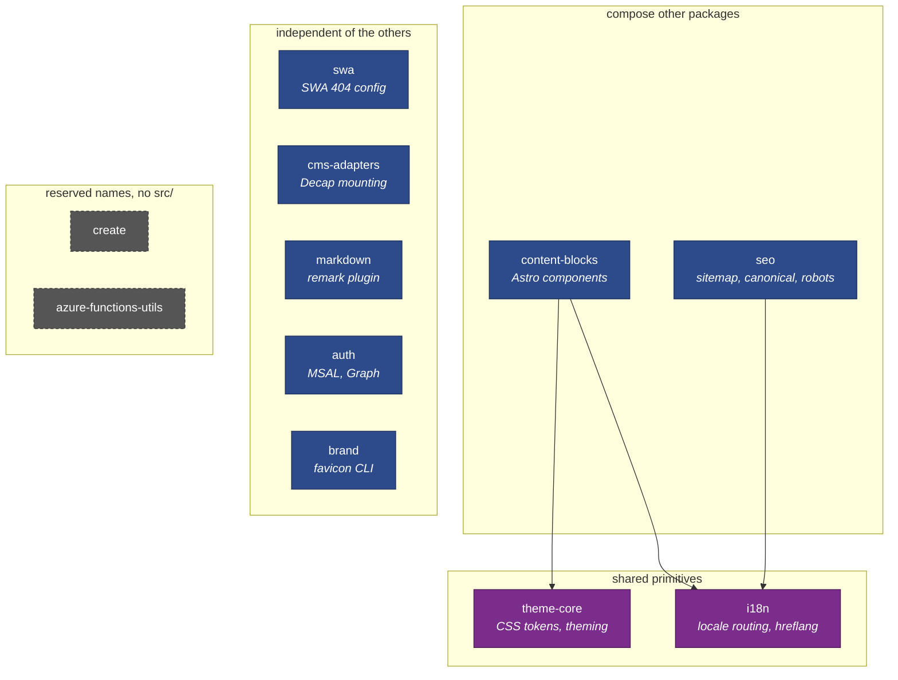
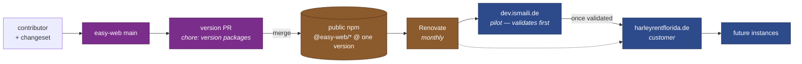
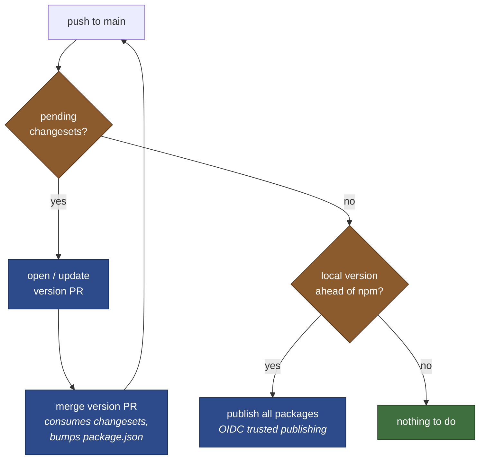
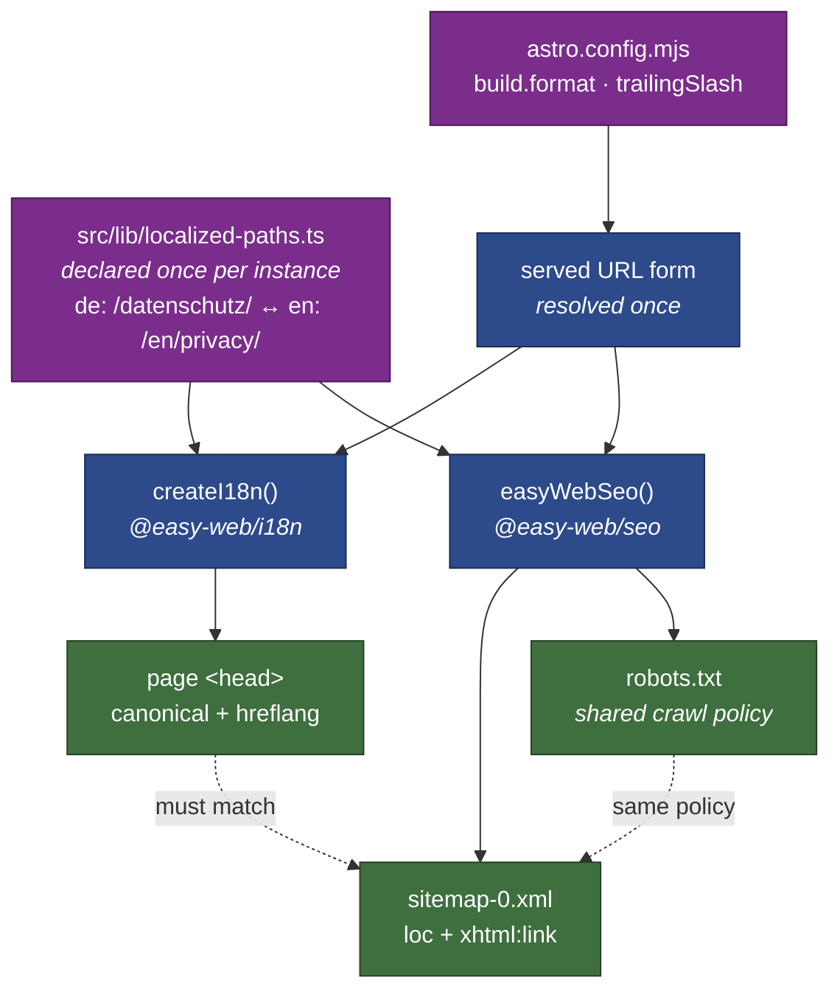

# easy-web Architecture

Visual reference for how the `@easy-web/*` family is wired, released and consumed.
Diagrams are Mermaid and render inline on GitHub.

> Canonical ecosystem docs (ADRs, repo topology, adoption matrix) live in the
> [`websites` meta-repo](https://dev.azure.com/it-ci/websites/_git/websites).
> This file covers only what is internal to `easy-web`.

## Package graph

Nine shipping packages, two reserved stubs. There are only **three** runtime
edges between them — everything else is independent.

Everything else each package needs is supplied by the consuming instance as a
peer dependency:

| Package | Peer dependencies |
| :--- | :--- |
| `content-blocks` | `astro`, `zod` |
| `i18n` | `astro`, `@inlang/paraglide-js` |
| `seo`, `swa`, `cms-adapters`, `markdown` | `astro` |
| `auth` | `react`, `react-dom` |
| `theme-core`, `brand` | none |

**Why `i18n` and `theme-core` are dependencies rather than peers.** Under
Changesets `fixed` grouping, an intra-workspace *peer* dependency forces every
release to be a major. They are pure functions and CSS custom properties, so a
duplicate copy costs bundle size rather than correctness. `auth` keeps its React
peer declaration because two MSAL instances corrupt the shared token cache —
there, duplication *is* a bug. See
[ADR 0016](https://dev.azure.com/it-ci/websites/_git/websites?path=/docs/decisions/0016-intra-workspace-dependencies-over-peer-dependencies.md).

## Propagation: one fix reaches every site

The reason the monorepo exists. A change lands once and every instance inherits
it through npm.

All 11 packages share one version (`fixed` grouping), so "which versions work
together?" has a single answer. Pilot-first is a policy, not a mechanism:
`dev.ismaili.de` takes a new version before any customer site does.

## Release flow

`changesets/action` does one of two things depending on whether changesets are
pending. Both branches must stay reachable — gating on only the first is what
previously made publishing impossible.

The second condition is what makes the publish branch reachable: merging the
version PR removes the changesets, so a "pending changesets" gate alone would
skip publishing forever.

## SEO: one declaration, two surfaces

Canonical URLs, in-page `hreflang` and the sitemap must agree byte-for-byte, or
search engines treat `/x` and `/x/` as competing duplicates and drop mismatched
hreflang clusters. Every emitted URL is therefore derived from one model.

Routes whose slug is identical across locales pair automatically and are not
declared. Only the ones that differ — `/datenschutz/` vs `/en/privacy/` — need
an entry, and a stale entry fails the build rather than degrading silently.

`robots.txt` and the sitemap read the same crawl policy, so a path cannot be
disallowed in one and advertised in the other.

## See also

* [`AGENTS.md`](../AGENTS.md) — repo orientation, workspace layout, publishing workflow
* [`README.md`](../README.md) — package inventory
* [ADR index](https://dev.azure.com/it-ci/websites/_git/websites?path=/docs/decisions) — ecosystem decision records
